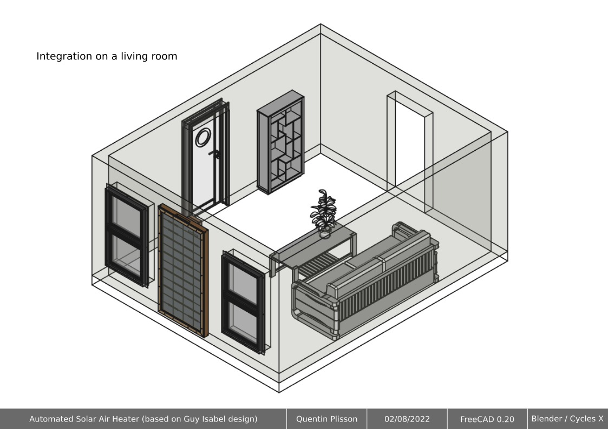

# Infographie

Ce document est régi par les termes de la licence juridique [Creative Commons CC-BY-SA 4.0](https://creativecommons.org/licenses/by-sa/4.0/deed.fr) 

---

Imaginé une voiture en plein soleil au mois d'août ? Le capteur solaire thermique - Low-tech c'est exactement la même chose mais optimiser pour votre bâtiment. L'illustration ci-dessus vous donne un aperçu de l'intégration d'un tel équipement sur le bâti.

[Enerlog](https://www.enerlog.fr/) ou [Aezeo](https://aezeo.com/) ont des techniques similaires voires identiques.

## Principes et vue d'ensemble

## Plans et dimensions 

## Développement sur FreeCAD

---

